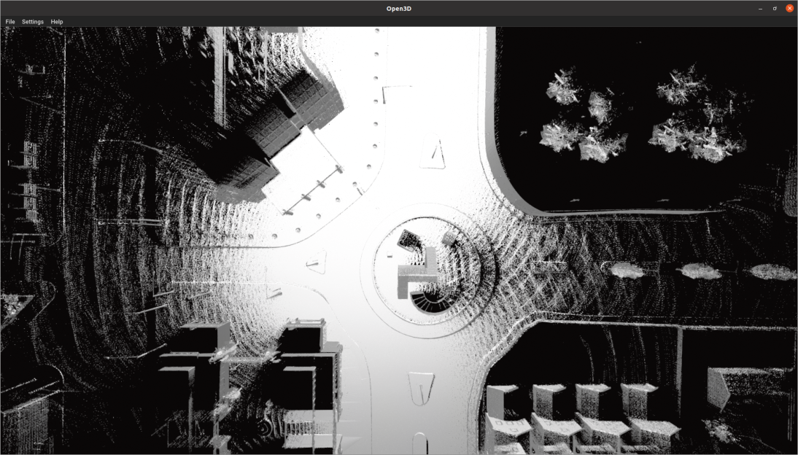
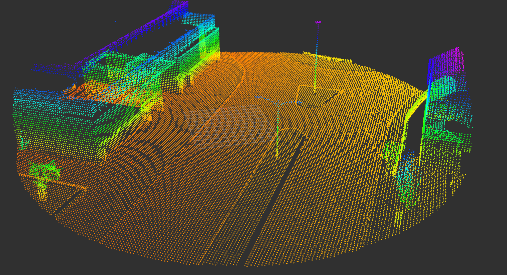
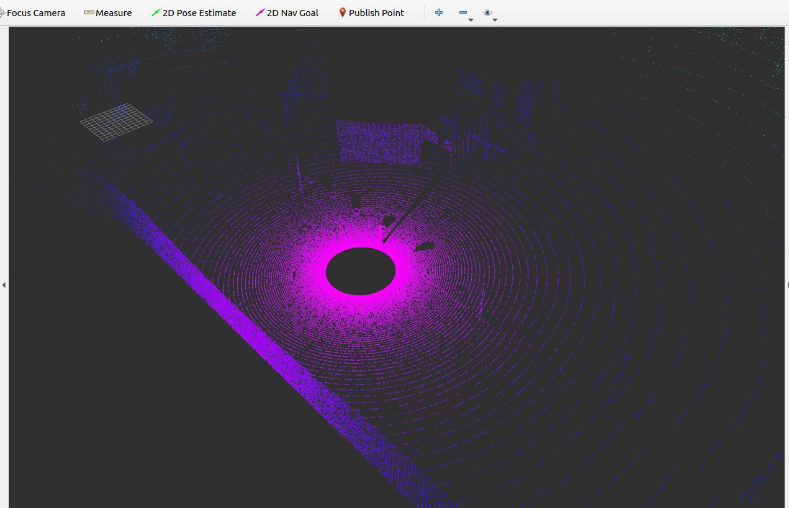

# Indy Autonomous Challenge 2021 
Implemented GPS Assisted Localization of high velocity autonomous car using LiDAR sensor.

## Construction of Map
To perform localization in mapped enviroment first we need to create the map which is done using the map generator package.

  

## Local Map Extraction
Given the Estimate of our location from the GPS data we need to create a local map around the estimate.We use octree point cloud search for this purpose . This is done in INDY-Slam package.

  
  

## ICP Implementation
After extracting the local map we need to apply the ICP algorithm between the local point cloud and the current liDAR scan. This gives us the transformation between the estimate localtion(from GPS) and the acutal position. This is done in the LIME package.
